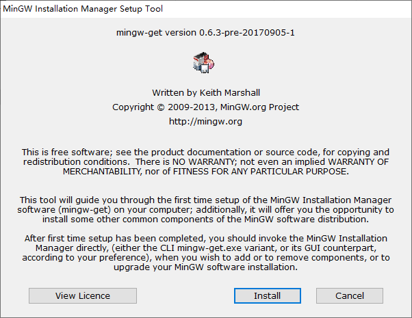
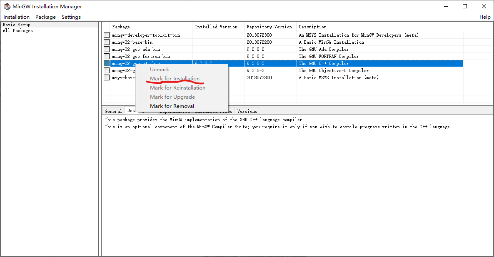
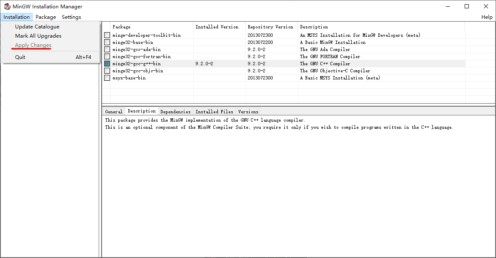
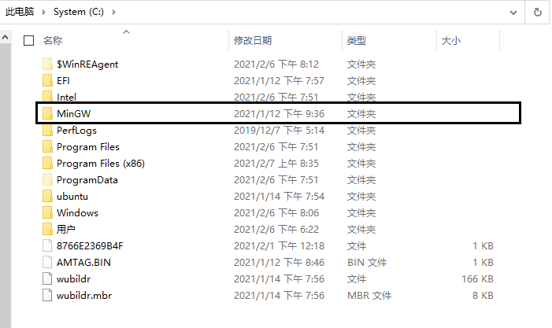
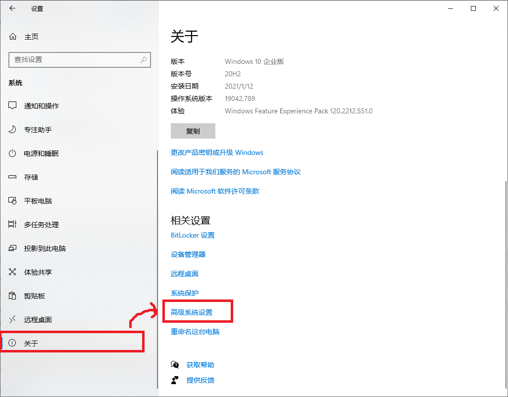
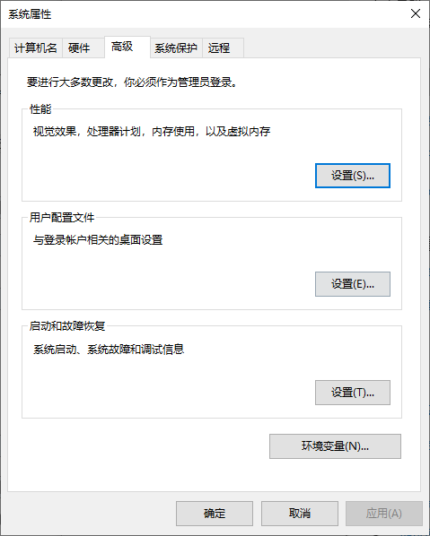
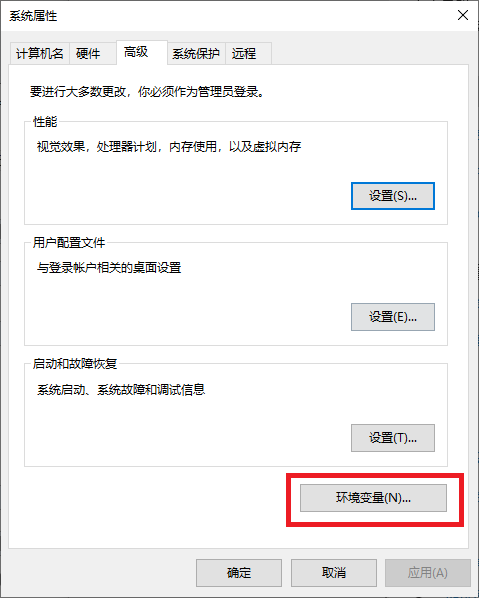
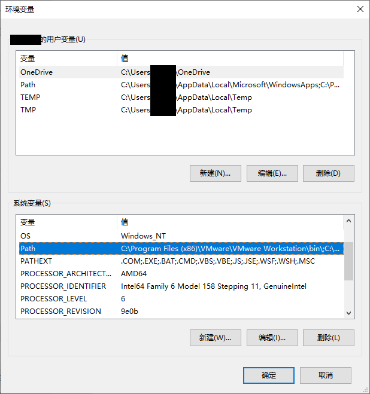
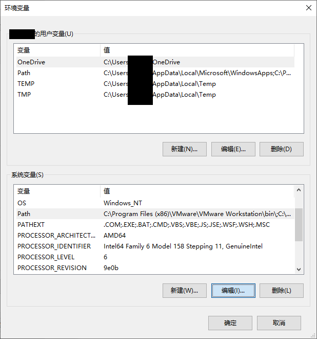
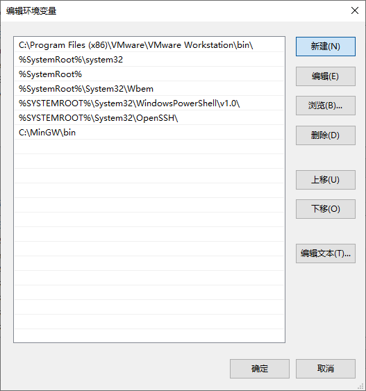

**Update 2025/12/3 现在我自己都不用这个方法了，我都直接下一个带MinGW的Code::Blocks然后直接把他的g++设置到环境变量里**

**Update 2021/8/6 文件换到蓝奏云上了，下载体验应该会让人更舒适一些**

**Update 2021/2/8 有同学测试貌似下载不了了，目前正在观察**

　　有很多同学都不知道如何安装G++编译器，直接使用Dev-C++的编译器。

　　直接使用Dev-C++的G++编译器在64位操作系统上没问题，在32位操作系统上就会出问题。

　　现在本文介绍一下安装原版G++的方法。

　　打开MinGW官网，

　　？？？

　　慢着，MinGW官网好像污染了

　　经验证，要用某些操作才可以正常访问。

　　验证日期：2021/2/7 时间：下午2：15

　　啊，应该没事，直接提供网盘链接：

<https://wws.lanzoui.com/ih3Bksaipmd> 密码：gcpp

　　原**百度网盘**链接：[https://pan.baidu.com/s/1fNR67KrLRmO-v4s9TRNTQw](https://pan.baidu.com/s/1fNR67KrLRmO-v4s9TRNTQw "https://pan.baidu.com/s/1fNR67KrLRmO-v4s9TRNTQw") 提取码：yhsq

　　其他下载链接：<https://share.weiyun.com/KrwHH9ud>；<https://url20.ctfile.com/f/33117920-505073190-a1f4fd> 密码：2792

　　打开后，一路戳Install**那个位置**就行了。

　　安装好后，会自动开启，没有自动开启的点这个：

　　点开界面之后，应该能看到类似这样的界面：

　　我这里因为安装好了，所以那个mingw32-gcc-g++-bin前面有绿的标记。

　　没有安装好的应该和别的一样。

　　然后右键，点击Mark for Installation。

　　因为已经装好了，我这里就点不了了。

　　然后这项前面就应该有一个标记。

　　再点击菜单栏的Installation，再点击Apply Changes。

　　照样，我已经装好了，所以点不到。

　　然后再点击Apply，就不提供截屏了。

　　然后就是等待下载。下载很慢，有时会发生错误。发生错误有Apply就点，没有就随便点。

　　下载完成后，在C盘根目录下应该有MinGW文件夹，

　　看到了那大概率是安装成功了。

　　接下来我们添加环境变量。

　　我用的是Windows 10，Windows 7的不太一样，你们百度一下就知道怎么做了。

　　首先打开设置，点击“系统”：

　　在左边最下方找到关于，再在右边点击高级系统设置

　　点开来就像下面这样：

　　点击环境变量：

　　点开后在下面的系统变量中找到Path，点编辑：

　　点击“新建”，输入“C:\MinGW\bin",点确定。

　　然后把前面的窗口关掉，重启你的编译软件，再试试，应该就可以正常用G++编译了。
