啊，最近又有人问我在Windows 上Emacs怎么安装。

嗯。Windows 上安装Emacs的确没Linux方便。

下面切入正题。

首先，打开[GNU Emacs官网](https://www.gnu.org/software/emacs/ "GNU Emacs官网")。这次官网没炸。

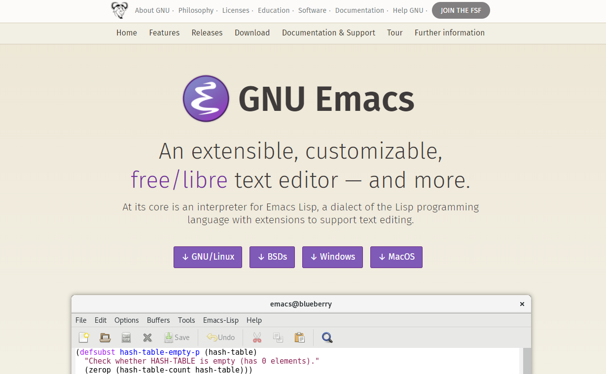

点击Windows

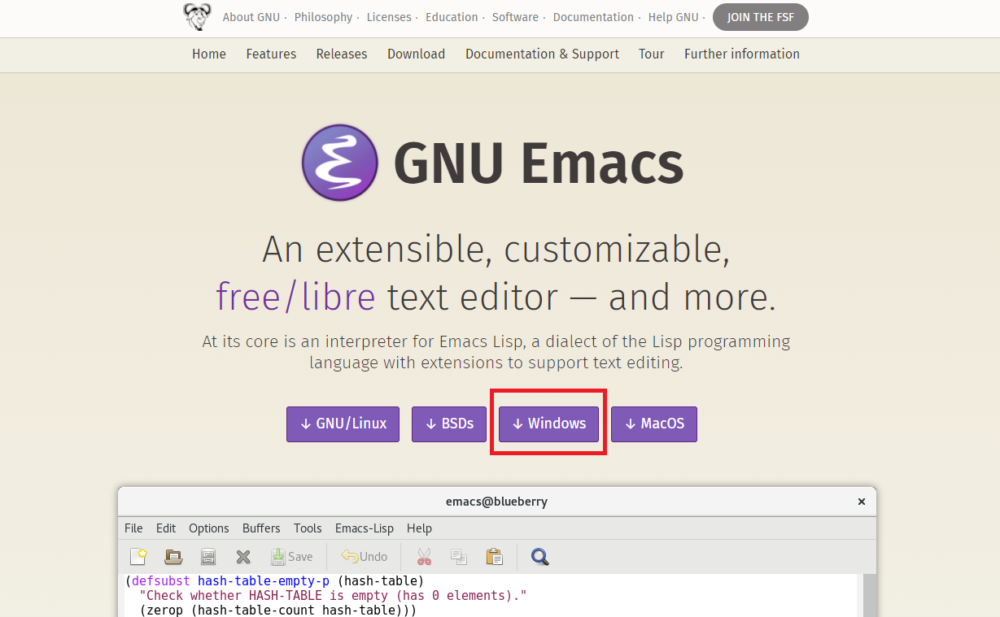

点击Windows后能打开如下界面：

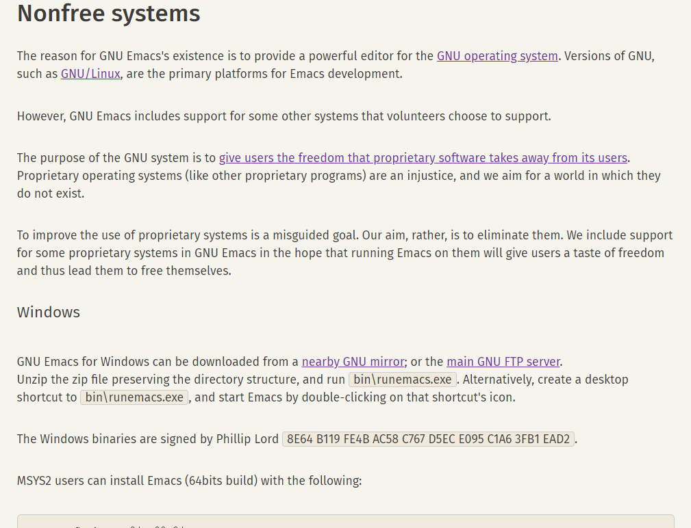

点击nearby GNU mirror：

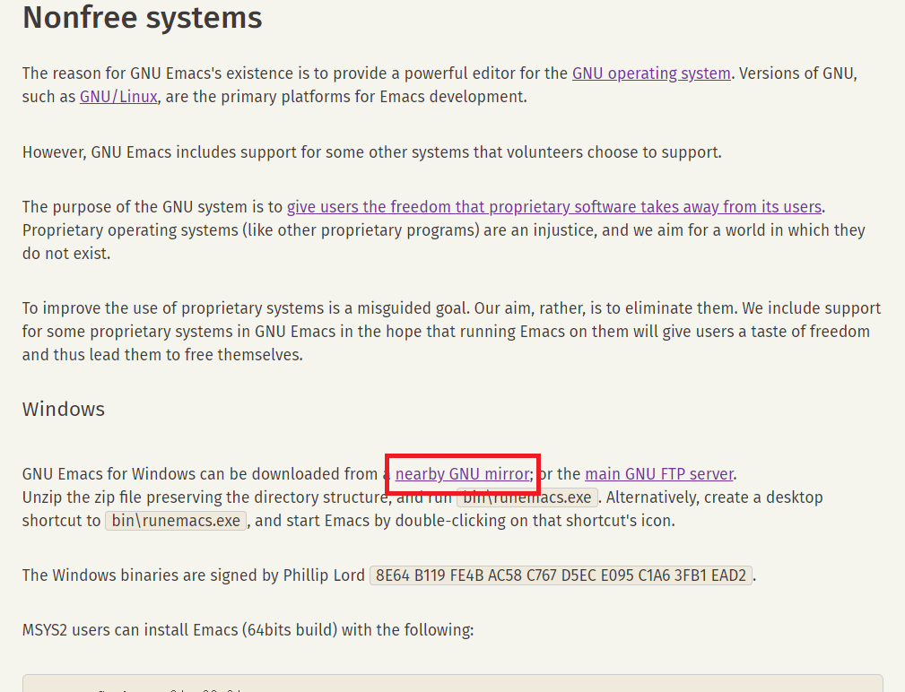

当然，你也可以点击main GNU FTP server。（补：我现在发现main GNU FTP server挺快的）

有的时候推荐的最近的镜像站打不开，就像这样

遇到这种情况只需要返回并重新进入即可。一次不行就多试几次

点开来之后见到这样的界面：

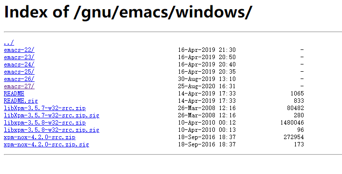

选择最新版本的进入，我这个时候最新版本是27。点开来就像这样：

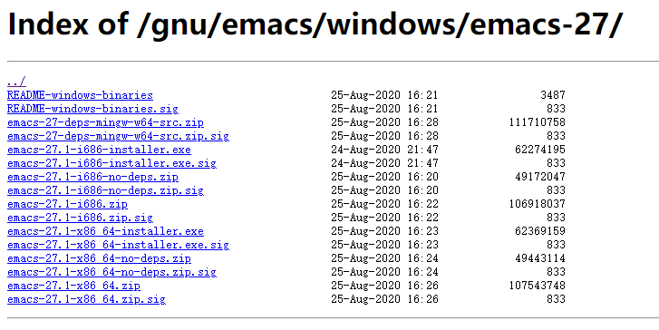

这里有32位和64位两个版本。简单介绍一下如何判断自己的电脑是32位还是64位。

演示系统为Windows 10 20H2

在设备规格一栏中能见到以下一项：

我的是64位操作系统。

比我的系统版本低的应该能看到这样的：

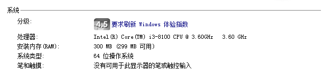

（一看就是虚拟机）

这样我们就区分开来了32位和64位的操作系统。

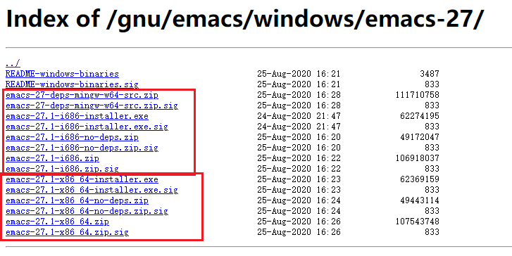

（上面的框框错了，上边界应该往下两行）

上图中上面的框指的是32位的，下面的框是64位的。以64位的为例：

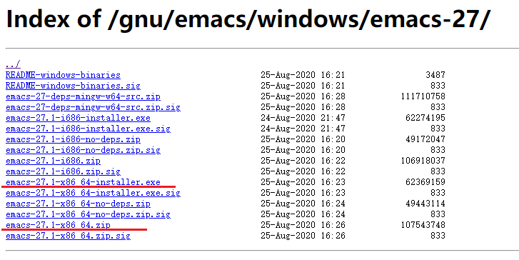

上面这两个选项中两个的区别不太好说，我用下面这个。

下载下来像这样

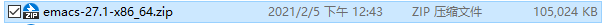

选我下面给的这个选项解压，点别的话会导致解压的文件夹文件很多。

建议放在C:\Program Files文件夹下

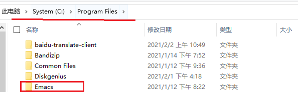

有可能会报错，如果你的是管理员账户的话就直接点继续，不是的话就只好放别的地方了。

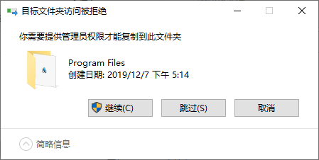

然后打开文件夹里面的bin目录，打开addpm.exe

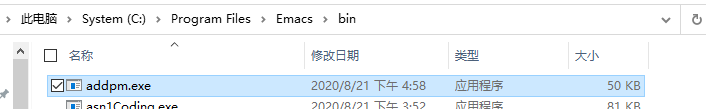

弹出如下窗口（背后有一黑的控制台），点击确定。

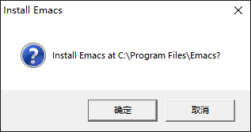

然后你就能在开始菜单里发现这个：

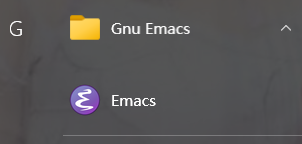

要添加桌面快捷方式的话，右键点击固定在开始屏幕

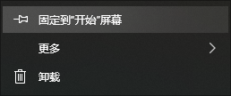

然后到开始屏幕拖动它，按住鼠标点Ctrl + D到桌面，松开鼠标创建桌面快捷方式。

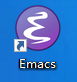

然后就可以享受你的Emacs了。

附：Windows 7及以上Emacs配置文件目录：C:\Users\（当前用户名）\AppData\Roaming

Windows不能直接建立.emacs文件，需要通过在Emacs里先保存配置文件再修改。下次详细说明。

[我的 Emacs 配置文件](https://www.cnblogs.com/g-mph/p/14488673.html "我的 Emacs 配置文件")
