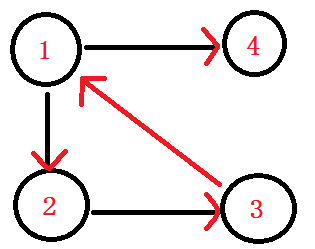
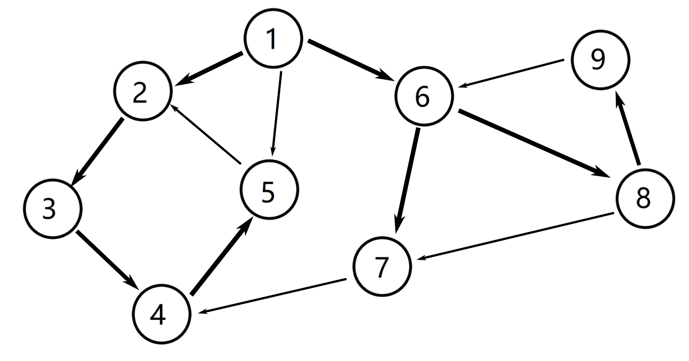
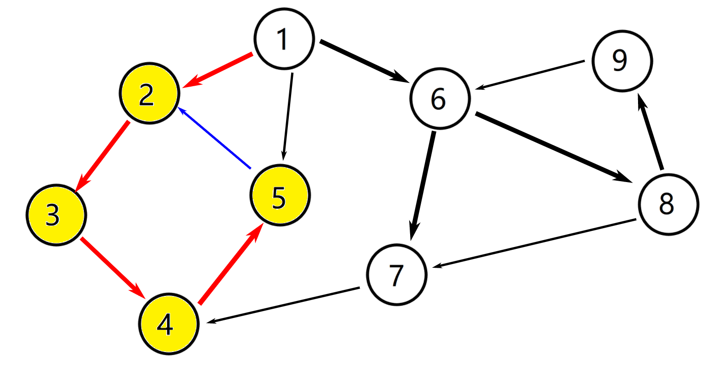
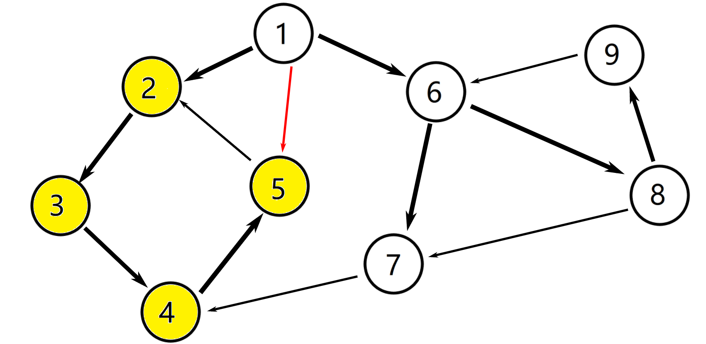
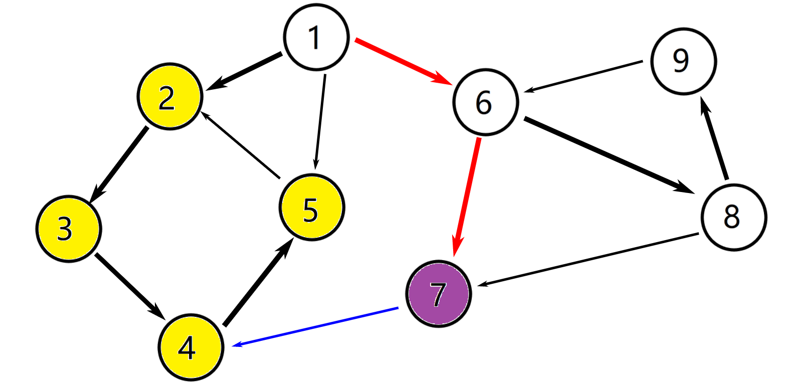
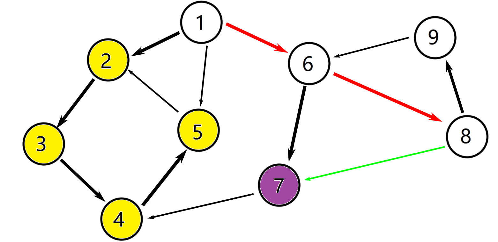
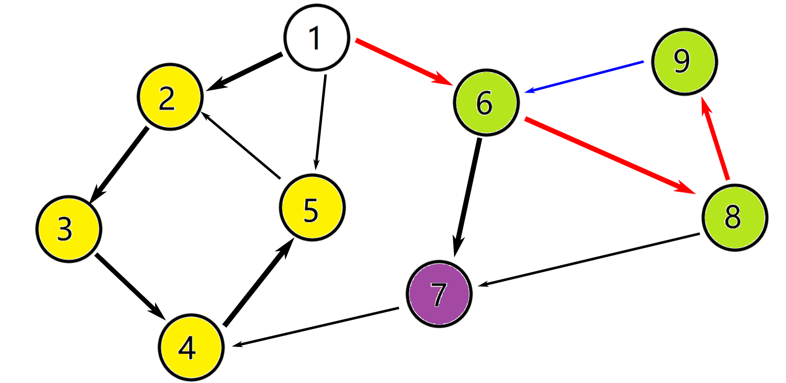
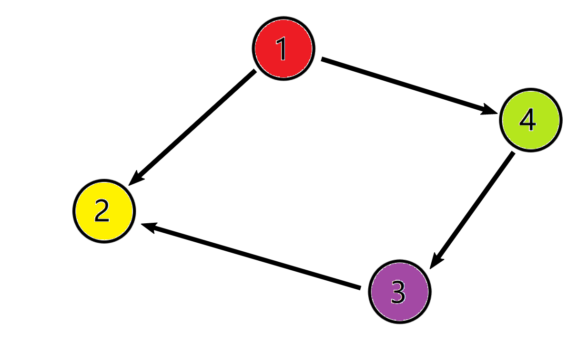

网上看了几篇博客，还有OI Wiki，觉得整合度不够，于是特意写了篇博客。

# 参考资料
[全网最!详!细!Tarjan算法讲解。](https://blog.csdn.net/hurmishine/article/details/75248876)
[强连通分量(SCC)与缩点](https://hawa130.wordpress.com/2018/08/09/scc%e4%b8%8e%e7%bc%a9%e7%82%b9/)
[强连通分量 - OI Wiki](https://oi-wiki.org/graph/scc/)

# 正文
在学习强连通分量和缩点之前，请务必理解邻接表。

**以下有OI Wiki的内容，有大佬博客里的内容，也有我自己的内容。**
## 强连通分量
### 引入

**强连通**的定义是：**有向图** G 强连通是指，G 中任意两个结点连通。
**强连通分量**（Strongly Connected Components，简称SCC）的定义是：极大的**强连通**子图。

举一个简单的例子。下面是一个有向图。



在这个图中， 1和2互相有路径可以到达对方，所以这两个点**强连通**；
1、2和3中任意两个点都连通，它们是这整个有向图的**强连通分量**。

### 求强连通分量。
下面我们介绍使用Tarjan算法求强连通分量。

我们举个例子说明这个算法是怎么运作的。图片取自《算法竞赛进阶指南》。



从 $①$ 进入，`dfn[1] = low[1] = ++index == 1`
入栈 $①$，此时的栈中元素为 $①$，`vis[1] = true`，即点 $①$ 在栈中。

往下找到 $②$，`dfn[2] = low[2] = ++index == 2`
入栈 $②$，此时栈中元素为 $①②$，`vis[2] = true`

继续往下找到 $③$，`dfn[3] = low[3] = ++index == 3`
入栈 $③$，此时栈中元素为 $①②③$，`vis[3] = true`

继续往下找到 $④$，`dfn[4] = low[4] = ++index == 4`
入栈 $④$，此时栈中元素为 $①②③④$，`vis[4] = true`

继续往下找到 $⑤$，`dfn[5] = low[5] = ++index == 5`
入栈 $5$，此时栈中元素为 $①②③④⑤$，`vis[5] = true`

继续往下找到 $②$ 他太爷爷，`dfn[2]`被访问过并且还在栈中，说明这个 $②$ 还在这个强连通分量中，值得发现。`low[5] = min(low[5], dfn[2])`
确定关系：$⑤$ 节点比 $②$ 节点出现得晚，即`low[5] > dfn[2]`，所以 $⑤$ 是 $①$ 的子节点；`low[5] = 2`



然后发现 $⑤$ 这个点没有出边了，返回到 $④$ 这个点。
于是`low[4] = min(low[4], low[5]) = 2`

$④$ 这个点也没有出边了，返回到 $③$ 这个点。
于是`low[3] = min(low[3], low[4]) = 2`

$③$ 这个点也没有出边了，返回到 $②$ 这个点。
于是`low[2] = min(low[2], low[2]) = 2`，对没错，还是2

$②$ 也没有出边，但是这时我们会发现`low[2] == dfn[2] == 2`，这就是说，点 $②$ 是这个强连通分量的根，于是`sccnt++`（`sccnt`：强连通分量的个数），一直弹出栈顶元素，并把栈顶元素的颜色标记为`sccnt`（`color[2] = sccnt`），直到栈顶元素为2时最后弹出一次并标记颜色。此时栈中元素为 $①$，`vis[5] = vis[4] = vis[3] = vis[2] = false`。

返回到 $①$。因为 $①$ 比 $②$ 出现得早，即`low[1] < low[2]`，所以`low[1]`的值没变，还是1 

-----

点 $①$ 还有出边，继续往下找到 $⑤$。嗯？`dfn[5]`已经有一个值`5`了，再看`vis[5] == false`，说明 $⑤$ 这个点已经不在栈中了，所以`low[1] = min(low[1], dfn[5]) = 1`（因为`low[1] == 1`，`dfn[5] == 2`）



-----

~~唉，现在同学都在准备省选，要不是我去年NOIP第一题用了邻接矩阵，数组开得太大了，我也去参加省选了（看出我有多蒻了吧）~~

点 $①$ 还有出边，继续往下找找到 $⑥$，`dfn[6] = low[6] = ++index == 6`
入栈 $⑥$，此时栈中元素为 $①⑥$ ，`vis[6] = true`

继续往下找到 $⑦$，`dfn[7] = low[7] = ++index = 7`
入栈 $⑦$，此时栈中元素为 $①⑥⑦$，`vis[7] = true`

继续往下找到 $④$，发现`dfn[4] == 4`，说明 $④$ 已经被访问过了，又因为`vis[4] == false`，也就是 $④$ 不在栈中，就不用管它。

$⑦$ 没有别的出边了。判断此时`dfn[7] == low[7] == 7`，所以 $⑦$ 是一个强连通分量的根。于是：Ⅰ：`sccnt++`；Ⅱ：把栈顶元素（即 $⑦$ 的颜色标记为`sccnt`），将其弹出。此时栈中元素为 $①⑥$。



返回到 $⑥$，找到点 $⑧$，`dfn[8] = low[8] = ++index = 8`
入栈 $⑧$，此时栈中元素为 $①⑥⑧$，`vis[8] = true`

往下找到 $⑦$，发现`dfn[7] == 7`，说明 $⑦$ 已经被访问过了，又因为`vis[7] ==false`，$⑦$ 不在栈中，不用管。



回到 $⑧$，它还有一条出边到 $⑨$，`dfn[9] = low[9] = ++index = 9`
入栈 $⑨$，此时栈中元素为 $①⑥⑧⑨$，`vis[9] = true`

再往下找到 $⑥$，找到了他爷爷（他爸是 $⑧$），`dfn[6]`被访问过并且还在栈中，说明这个 $⑥$ 还在这个强连通分量中。`low[9] = min(low[9], dfn[6]) = 6`。

接着就是：
`low[8] = min(low[8], low[9]) = 6`
`low[6] = min(low[6], low[8]) = 6`

此时 $⑥$ 的出边已经找完了，又因为`low[6] == dfn[6] == 6`，所以 $⑥$ 是强连通分量的根，`sccnt++`，一直弹出栈顶元素，将栈顶元素颜色标记为`sccnt`，直到栈顶元素为6，最后弹出一次，标记颜色。此时栈中元素为 $①$，`vis[9] = vis[8] = vis[6] = false`。



返回到 $①$，$①$的出边也已经找完了，因为`low[1] == dfn[1] == 1`，所以 $①$ 是强连通分量的根，`sccnt++`，弹出栈顶元素（1），将栈顶元素颜色标记为`sccnt`。此时栈为空，`vis[1] = false`。


这个时候就完了吗？！
你以为就完了吗？！ 
然而并没有完，万一只走了一遍tarjan整个图没有找完怎么办呢？！ 
所以。tarjan的调用要在循环里解决，以使每一个点都被访问到。

### 代码

下面是tarjan函数的代码：

```cpp
void tarjan(int v) {       //Tarjan算法
  dfn[v] = low[v] = ++tot; //标记dfn[]访问顺序，还有low[]的初始值
  sta.push(v);             //让点v进栈
  vis[v] = true;           //标记这个点被访问过
  for (int i = head[v]; ~i; i = edge[i].next) { //一直循环这个点每一个出度，直到-1表示没有了，这也是为什么memset head数组时要赋-1
    int u = edge[i].to;               //定义u并把它赋成这条边的终点
    if (!dfn[u]) {                    //如果u没有被访问过
      tarjan(u);                      //找下面这个点
      low[v] = min(low[v], low[u]);   //这个点low[v]的值就是当前low[]的值与找到的u点的low[]值
    } else if (vis[u])                //如果u被访问过了，但是还在队列中
      low[v] = min(low[v], dfn[u]);   //low[v]就取这个点的low值与循环到的点u的dfn[u]的最小值
  }
  if (dfn[v] == low[v]) {   //如果发现v这个点的dfn[]和low[]相等，说明这个点是一个强连通分量的“根”。
    sccnt++;                //scc（Strongly Connected Component）， cnt（count），就是强连通分量的个数
    int u;                  //定义u变量，作为栈顶元素
    do { 
      u = sta.top();        //将u赋值为sta栈的栈顶元素
      vis[u] = false;       //将u弹出
      sta.pop();            //同上
      color[u] = sccnt;     //将u标记为这个强连通分量里的点
    } while (v != u);       //当v == u之后，结束循环
  }
}
```

在主函数里像这样调用tarjan函数：
```cpp
  for (int i = 1; i <= n; i++) //循环每一个点
    if (!dfn[i]) tarjan(i);    //如果dfn[i]没有值，即这个点被没有访问过，需要访问；
                               //如果dfn[i]已经有一个值，说明这个点被访问过了，不用担心漏了，
                               //同时也为了节省时间，就不访问了。
```
## 缩点
### 引入
**缩点**的定义：把**强连通分量**看成是一个大点，保留那些不在强连通分量里的边，这样的图就是**缩点**后的图。 
缩点后的图保留了所有不在分量里的边，而且缩点后的图是一个**有向无环图**（DAG），可以进行拓扑排序。

那么，缩点之后的图，就成了这样：



### 缩点的解决

现在问题来了，怎么储存缩点后的图？

在一开始调用的tarjan函数中，我们已经把同一个强连通分量中的点标记成了相同的颜色。为了重新建立一个缩点后的图，我们先把`head[]`数组和`edge[]`数组清空，在读入边的时候，我们把边的起点和终点分别存到`from[]`数组和`to[]`数组中。
在建立邻接表储存缩点后的图时，判断这些输入的点是否在同一个 SCC 中，如果不在就连边。 
用如下代码建立缩点后的图：

```cpp
  for (int i = 1; i <= m; i++)              //循环每一条边
    if (color[from[i]] != color[to[i]])     //如果这条边的出发点和终止点不在同一个强连通分量中
      add(color[from[i]], color[to[i]]);    //就连一条边
```

## 【模板】缩点
题目链接：[【模板】缩点](https://www.luogu.com.cn/problem/P3387)
### 审题
这题不仅需要缩点，还要找出一条路径使点权和最大。
因为 强连通分量（SCC） 中点可以互相到达，所以需要缩点使图变成一个有向无环图（DAG），强连通分量 内所有点权和即为缩点后该点的点权。
这题可以使用LPFA算法~~（Longest Path Fast Algorithm，发明者：沃·兹基硕德）~~来解决。
把松弛改为扩张：
```cpp
  if (dis[v] > dis[u] + siz[v]) dis[v] = dis[u] + siz[v];
->if (dis[v] < dis[u] + siz[v]) dis[v] = dis[u] + siz[v];
```
### 代码
详情请见[【题解】P3387 【模板】缩点](https://www.cnblogs.com/g-mph/p/14632462.html)
