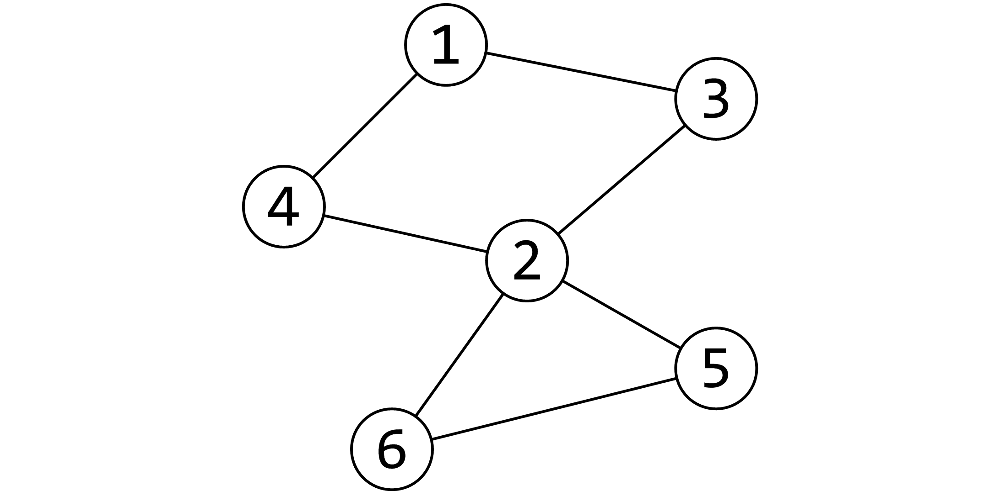
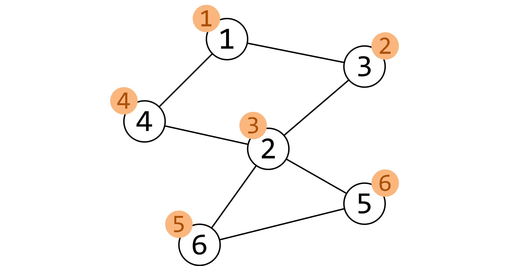

:::note
之前作图的时候没考虑到深色模式，如果您觉得看不清，可以考虑切换到浅色模式，抱歉。
:::

这题搞了我半天……

# 题意

这题给我们一个图，求这一个图的割点。

首先我们需要了解割点是什么，简单来说就是删除了这个点之后整个图不是连通图。

比如下图中的 $②$ 就是割点*（图片来自[OI Wiki](https://oi-wiki.org/)）*。



# 方法

OI Wiki上对割点的讲解：[link](https://oi-wiki.org/graph/cut/).

首先用dfs序给每一个节点打上时间戳*（图片来自[OI Wiki](https://oi-wiki.org/)）*，存在`dfn[]`数组中：



我们用像求强连通分量一样的 Tarjan 算法遍历每一个节点，用`low[]`数组存储从这个节点出发能到达的最远古的节点。

我们遍历每一个节点，然后更新节点的`low[]`值。更新方法：

如果搜索到的下一个节点没有在队列中，搜索完这下一个节点之后，如果这个儿子的`low[]`值小于自己的`low[]`值，就将`low[]`的值更新为它的儿子的`low[]`值。

本文中程序的`v`为当前节点，`u`为循环到的节点。

```cpp
      tarjan(u, v);                   //找下面这个点
      low[v] = min(low[v], low[u]);   //这个点low[v]的值就是当前low[]的值与找到的u点的low[]值的最小值
```

还有可能搜到了还在队列中的节点（即自己的祖先），就取`low[v]`与`num[u]`的最小值。

```cpp
else low[v] = min(low[v], num[u]);   //low[v]就取这个点的low值与循环到的点u的dfn[u]的最小值
```

接下来就要考虑如何发现割点并把发现的割点的数量记录下来。

当找到的点不在队列中时，先更新`low[]`的值，再判断如果`low[u] >= num[v]`，即**这个点不能回到祖先节点**了，

并且**此时所在的点不是祖先节点**，而且**此时所在的点没有被标记过**，就`` flag[v] = true, res++``。

```cpp
      if (father != v && low[u] >= num[v] && !flag[v]) flag[v] = true, res++; //如果满足割点的条件就标记是割点，并且让答案的个数增加。
```

另外，如果**此时所在的点是祖先节点**，并且**它有两个及以上的儿子** **（只有不在队列中的点才算儿子）**，而且**没被标记过**，就`` flag[v] = true, res++``。

```cpp
  if (father == v && child >= 2 && !flag[v])    //如果自己有两个儿子并且没有被访问过
                                                //只有不在队列中的点才算儿子。
    flag[v] = true, res++;
```

上面的儿子可以在遍历每一个节点的时候累加。

# 代码

```cpp
#include <cstdio>
#include <vector>
#include <iostream>
using namespace std;

inline int read() {
  int X = 0; bool flag = 1; char ch = getchar();
  while (ch < '0' || ch > '9') {if (ch == '-') flag = 0; ch = getchar();}
  while (ch >= '0' && ch <= '9') {X = (X << 1) + (X << 3) + ch - '0'; ch = getchar();}
  if (flag) return X;
  return ~ (X - 1);
}

inline void write(int X) {
  if (X < 0) {putchar('-'); X = ~ (X - 1);}
  int s[50], top = 0;
  while (X) {s[++top] = X % 10; X /= 10;}
  if (!top) s[++top] = 0;
  while (top) putchar(s[top--] + '0');
  putchar(' ');
  return;
}

int head[20004], low[20004], num[20004];
int index, res, cnt;
bool flag[20004], vis[20004];

vector<int> edge[100001];

void tarjan(int v, int father) {      //Tarjan算法
  num[v] = low[v] = ++index;          //标记dfn[]访问顺序，还有low[]的初始值
  vis[v] = true;                      //标记这个点被访问过
  int child = 0;
  for (auto u : edge[v]) {
    if (!vis[u]) {                    //如果u没有被访问过
      child++;
      tarjan(u, v);                   //找下面这个点
      low[v] = min(low[v], low[u]);   //这个点low[v]的值就是当前low[]的值与找到的u点的low[]值的最小值
      if (father != v && low[u] >= num[v] && !flag[v]) flag[v] = true, res++; //如果满足割点的条件就标记是割点，并且让答案的个数增加。
    } else low[v] = min(low[v], num[u]);        //low[v]就取这个点的low值与循环到的点u的dfn[u]的最小值
  }
  if (father == v && child >= 2 && !flag[v])    //如果自己有两个儿子并且没有被访问过
                                                //只有不在队列中的点才算儿子。
    flag[v] = true, res++;
}

int main() {
  int n, m;
  n = read(); m = read();
  for (int i = 1; i <= m; i++) {
    int x, y;
    x = read(); y = read();
    edge[x].push_back(y);
    edge[y].push_back(x);
  }
  for (int i = 1; i <= n; i++) 
    if (!vis[i]) index = 0, tarjan(i, i);
  write(res);
  putchar('\n');
  for (int i = 1; i <= n; i++) if (flag[i]) write(i);
  putchar('\n');
  return 0;
}
```
