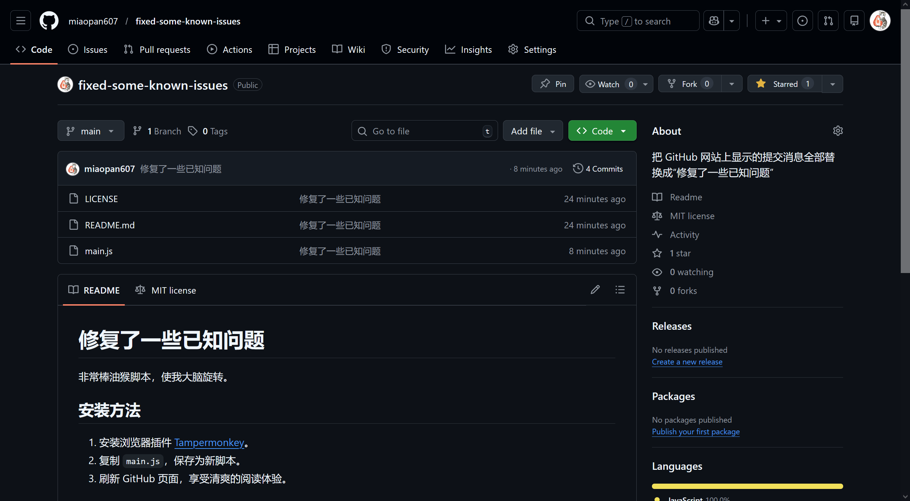

## 安装方法

1. 安装浏览器插件 [Tampermonkey](https://www.tampermonkey.net/)。
2. 打开 [Greasy Fork 发布页](https://greasyfork.org/zh-CN/scripts/565802)
3. 点击安装按钮，确认安装。
4. 刷新 GitHub 页面，享受清爽的阅读体验。

## 效果演示

### 安装前

### 安装后

## 仓库地址

[GitHub 仓库](https://github.com/miaopan607/fixed-some-known-issues)

## 免责声明

本脚本仅供娱乐，请勿在需要认真审查代码变更的生产环境中使用（笑）。